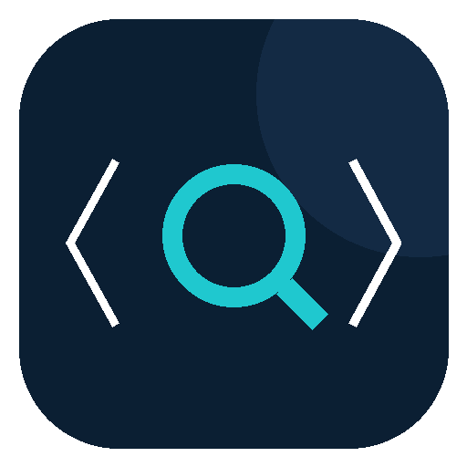
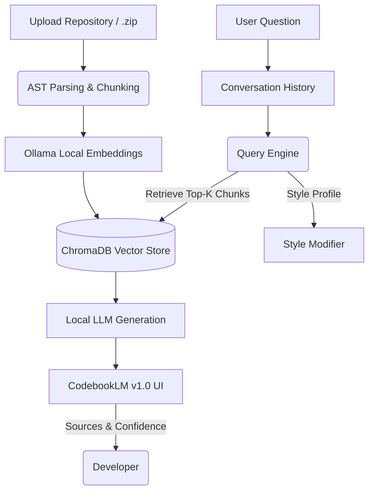
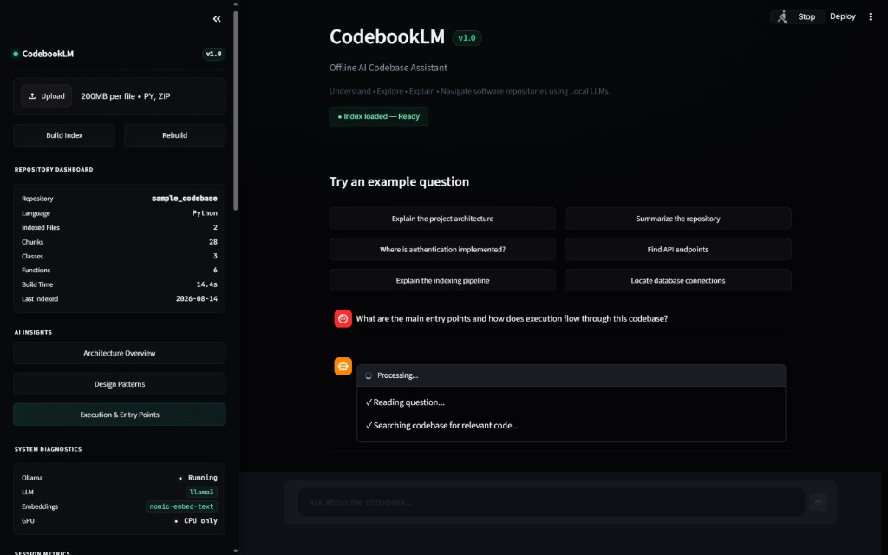
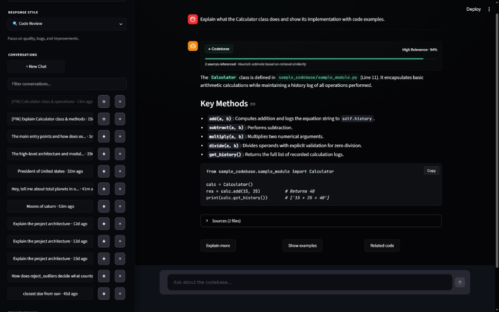

<p align="center">
  
</p>

<h1 align="center">📘 CodebookLM v1.0</h1>

<p align="center">
  <strong>Offline AI Codebase Assistant — Private, Local, No Internet Required</strong>
</p>

<p align="center">
  <a href="#features"></a>
  <a href="#installation"></a>
  <a href="#technology-stack"></a>
  <a href="LICENSE"></a>
</p>

<p align="center">
  <em>Private codebase intelligence, with a conversation that keeps up.</em>
</p>

---

## 🎯 What is CodebookLM?

CodebookLM is a **fully offline, AI-powered software repository assistant** that lets developers explore, understand, and query codebases using natural language — like ChatGPT, but tailored for code architecture, and **nothing ever leaves your machine**.

It builds a local semantic index of your repository using AST parsing, vector embeddings, and a configurable local LLM to answer architectural questions, trace implementation logic, and summarize codebases instantly.

> **Perfect for:** Enterprise environments, proprietary code, defense applications, or any scenario where cloud-based LLMs are prohibited.

---

## ✨ Features

| Feature | Description |
|---------|-------------|
| 🔒 **100% Offline & Private** | No internet required. Your code never leaves your machine. |
| 📄 **Source Attribution** | Every response includes collapsible citations with file names, line numbers, and relevance scores. |
| 📊 **Repository Dashboard** | Instant overview: indexed files, chunks, classes, functions, build time. |
| 🏗️ **Architecture Explorer** | VS Code-like file tree, per-file code structure (AST), and dependency analysis. |
| 📌 **Conversation Manager** | Smart titles, search, pin, relative timestamps, rename & delete. |
| 🎨 **4 Style Profiles** | Concise · Detailed · Tutorial · Code Review — switch anytime. |
| 📈 **Confidence Indicators** | Visual bar with heuristic disclaimer and source count. |
| 💡 **Response Actions** | One-click "Explain more", "Show examples", "Related code" follow-ups. |
| 🤖 **AI Insights** | Architecture, Patterns, and Entry Points analysis at one click. |
| 📦 **Dependency Analysis** | Auto-classified third-party, local, and stdlib imports. |
| ⚡ **Long-context Handling** | Auto-truncation with warning badge when history exceeds model window. |
| 🔄 **Background Generation** | Thread-safe async generation — switch chats while responses generate. |
| 🌐 **Hybrid Retrieval** | Auto-fallback to general knowledge when code isn't relevant. |
| 📤 **Export Conversations** | Save as Markdown or plain text for documentation. |
| 🎭 **Premium UI** | Glassmorphism, emerald accent palette, smooth animations, splash screen. |

---

## 🏗️ Architecture



---

## 🛠️ Technology Stack

| Component | Technology |
|-----------|-----------|
| **Frontend** | Streamlit + Custom CSS design system |
| **RAG & Indexing** | LlamaIndex |
| **Vector Database** | ChromaDB (persistent) |
| **Local LLM Engine** | Ollama |
| **Default LLM** | `devstral-small-2:24b` (configurable) |
| **Embeddings** | `nomic-embed-text` |
| **AST Parsing** | Python `ast` module |
| **Background Tasks** | `threading` with Lock() |

---

## 📦 Installation

### Prerequisites

| Requirement | Version |
|-------------|---------|
| Python | 3.10+ |
| [Ollama](https://ollama.com) | Latest |
| RAM | 8GB+ (16GB recommended) |
| GPU | Optional (NVIDIA recommended for speed) |

---

### 🪟 Windows

```powershell
# 1. Clone the repository
git clone https://github.com/aayush0778/CodebookLM.git
cd CodebookLM

# 2. Create virtual environment (recommended)
python -m venv venv
.\venv\Scripts\Activate.ps1

# 3. Install dependencies
pip install -r requirements.txt

# 4. Install & start Ollama (download from https://ollama.com)
# After installation, open a terminal and run:
ollama serve

# 5. Pull required models (in a new terminal)
ollama pull devstral-small-2:24b
ollama pull nomic-embed-text

# 6. Launch CodebookLM
python -m streamlit run app.py
```

**Quick launch (after setup):**
```powershell
# Option A: Batch file
.\CodebookLM.bat

# Option B: PowerShell
.\Launch-CodebookLM.ps1
```

---

### 🐧 Linux / 🍎 macOS

```bash
# 1. Clone the repository
git clone https://github.com/aayush0778/CodebookLM.git
cd CodebookLM

# 2. Create virtual environment (recommended)
python3 -m venv venv
source venv/bin/activate

# 3. Install dependencies
pip install -r requirements.txt

# 4. Install Ollama
curl -fsSL https://ollama.com/install.sh | sh

# 5. Start Ollama (in background)
ollama serve &

# 6. Pull required models
ollama pull devstral-small-2:24b
ollama pull nomic-embed-text

# 7. Launch CodebookLM
streamlit run app.py
```

---

### 🐳 Docker (Optional)

```bash
# Coming soon — Docker support is planned for a future release.
```

---

## 🚀 Usage

### Quick Start

1. **Launch** the app using one of the methods above
2. **Upload** your `.py` files or a `.zip` archive via the sidebar
3. **Build Index** — click the button to parse and embed your codebase
4. **Ask Questions** — use the chat interface for architectural, implementation, or code review questions
5. **Inspect Sources** — expand the "📄 Sources" panel to see exactly where the answer came from
6. **Export** — save your conversation as Markdown or text

### Example Questions

```
"What is the main architecture of this codebase?"
"How does error handling work across modules?"  
"Show me all the API endpoints and their handlers"
"What design patterns are used here?"
"Explain the data flow from input to output"
```

### Style Profiles

Switch between response styles anytime from the sidebar:

| Profile | Best For |
|---------|----------|
| ⚡ **Concise** | Quick answers, bullet points |
| 📖 **Detailed** | Deep explanations with examples |
| 🎓 **Tutorial** | Step-by-step learning |
| 🔍 **Code Review** | Bug hunting, quality analysis |

### Configuration

All settings are in [`config.py`](config.py):

```python
LLM_MODEL = "devstral-small-2:24b"   # Change to any Ollama model
EMBEDDING_MODEL = "nomic-embed-text"
TOP_K = 8                             # Chunks retrieved per query
LLM_CONTEXT_WINDOW = 8192            # Model context window
MAX_HISTORY_TURNS = 4                 # Conversation turns to include
RELEVANCE_THRESHOLD = 0.35           # Below this → general knowledge mode
```

---

## 📁 Project Structure

```
CodebookLM/
├── app.py                        # Main Streamlit application (UI + CSS)
├── config.py                     # Centralized configuration
├── requirements.txt              # Python dependencies
├── test_imports.py               # Import verification script
├── CodebookLM.bat                # Windows quick launcher
├── Launch-CodebookLM.ps1         # PowerShell quick launcher
│
├── ingestion/
│   ├── ast_chunker.py            # AST-based code chunking
│   └── indexer.py                # ChromaDB index builder
│
├── retrieval/
│   ├── query_engine.py           # RAG query engine + hybrid fallback
│   ├── repo_tree.py              # File tree builder + AST analysis
│   └── background_tasks.py       # Thread-safe BackgroundTaskManager
│
├── data/                         # (gitignored) Runtime data
│   ├── chroma_index/             # Vector store
│   ├── chat_history/             # Saved conversations
│   ├── query_log.jsonl           # Query audit log
│   └── uploads/                  # Uploaded repositories
│
└── assets/                       # Screenshots & media
    ├── logo.png
    ├── codebooklm_dashboard.png
    └── codebooklm_retrieval.png
```

---

## 📸 Screenshots

### Main Dashboard & Query Processing

*Obsidian-dark interface with reasoning steps, system diagnostics, and real-time repository metrics.*

### Grounded Retrieval in Action

*Code review style response with 94% confidence grounding, formatted code blocks, and conversation manager.*

---

## 🔧 Troubleshooting

| Issue | Solution |
|-------|----------|
| **"No index loaded"** | Upload files and click "Build Index" in the sidebar first |
| **"Model not found"** | Check Ollama is running (`ollama list`) and models are pulled |
| **GPU not detected** | Ensure `nvidia-smi` is in PATH; app falls back to CPU automatically |
| **Slow responses** | Try a smaller model like `llama3` in `config.py`, or ensure GPU is available |
| **Context overflow warnings** | Start a new chat or reduce `MAX_HISTORY_TURNS` in `config.py` |
| **Port conflict** | Run `streamlit run app.py --server.port 8502` to use a different port |

---

## 🗺️ Roadmap

- [ ] Multi-language AST parsing (JavaScript/TypeScript, Go, Rust, Java)
- [ ] Advanced chunking strategies (semantic boundaries, dependency-aware)
- [ ] Direct GitHub repository ingestion via URL
- [ ] Persistent multi-repository indexing
- [ ] Docker containerization
- [ ] VSCode extension
- [ ] PDF/documentation ingestion alongside code

---

## 👤 Author

**Aayush Singh**

- GitHub: [@aayush0778](https://github.com/aayush0778)

---

## 🙏 Credits

Built with [Streamlit](https://streamlit.io), [Ollama](https://ollama.com), [LlamaIndex](https://www.llamaindex.ai/), and [ChromaDB](https://www.trychroma.com/).

Designed and built for developers who care about code privacy and AI accessibility.

---

<p align="center">
  <strong>📘 CodebookLM v1.0</strong><br>
  <em>Offline · Private · Local AI · No Internet Required</em>
</p>
