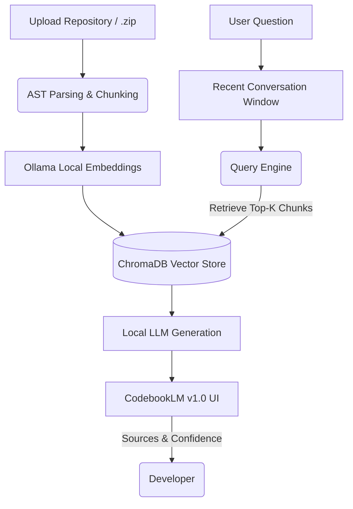

# 📘 CodebookLM v1.0
Offline AI Codebase Assistant

> Private codebase intelligence, with a conversation that keeps up.

CodebookLM is an offline AI-powered software repository assistant that enables developers to explore, understand and query software repositories using Retrieval-Augmented Generation (RAG), semantic search and local Large Language Models while ensuring complete source-code privacy.

---

## Overview

CodebookLM is a state-of-the-art, fully offline AI-powered software repository assistant. It empowers developers, researchers, and engineers to interact with their codebases using natural language, much like ChatGPT, but explicitly tailored to complex software architecture—without a single byte of code ever leaving your machine. 

By building a local semantic index of your repository using advanced AST parsing and a configurable local Large Language Model, CodebookLM can answer intricate architectural questions, trace implementation logic across multiple files, and summarize extensive codebases instantly.

It prioritizes:
1. **Privacy & Security**: Perfect for enterprise environments, proprietary code, or defense applications where cloud-based LLMs are prohibited.
2. **Transparency**: Every answer generated from your codebase includes explicit source attribution (File path, Line numbers, and Relevance scores).
3. **Continuity**: Recent chat turns are supplied to the model so natural replies such as “yes”, “that one”, and “show an example” keep their meaning.
4. **Crafted UX**: A local-first interface with layered depth, subtle motion, focused interaction states, and keyboard shortcuts.

## Features

- **100% Offline & Private:** No internet connection required. Your code never leaves your machine.
- **Source Attribution:** Every codebase-grounded response includes collapsible citations with file names, line numbers, and relevance scores.
- **Repository Dashboard:** Instant overview of your indexed repository including chunk count, build time, and status.
- **System Diagnostics:** Built-in monitoring for Ollama status, active LLM, Embedding model, and GPU VRAM usage.
- **Export Conversations:** Export your entire chat session as Markdown or Text for documentation or sharing.
- **Conversation-Aware Chat:** A bounded rolling context window preserves the active discussion without allowing long conversations to exhaust the model context.
- **Premium Desktop Experience:** Glass-like surfaces, depth-aware cards, purposeful micro-interactions, animated state transitions, and a cursor-follow glow create a polished desktop feel.
- **Accessible Motion:** All decorative motion respects the operating system’s `prefers-reduced-motion` setting.
- **Hybrid Retrieval:** Automatically falls back to general knowledge if the answer isn't in your codebase.

## Architecture



## Technology Stack

- **Frontend:** Streamlit with a custom local-first design system and interaction layer
- **RAG & Indexing:** LlamaIndex
- **Vector Database:** ChromaDB
- **Local LLM Engine:** Ollama
- **Default LLM:** `llama3` (configurable; `devstral-small-2:24b` is a recommended production option)
- **Default Embeddings:** `nomic-embed-text`

## Installation

### 1. Prerequisites
- Python 3.10+
- [Ollama](https://ollama.com) installed and running.

### 2. Install Dependencies
```bash
git clone https://github.com/aayush0778/Codebase-Agent.git
cd Codebase-Agent
pip install -r requirements.txt
```

### 3. Pull Required Models
Ensure Ollama is running, then download the necessary models:
```bash
ollama pull llama3
ollama pull nomic-embed-text
```

To use `devstral-small-2:24b` instead, pull it and update `LLM_MODEL` in `config.py`.

## Usage

### Launching the Application
You can use the provided desktop launchers for a quick start:
- **Windows:** Double-click `CodebookLM.bat`
- **PowerShell:** Run `.\Launch-CodebookLM.ps1`

Or run manually via terminal:
```bash
python -m streamlit run app.py
```

### Workflow
1. **Upload Repository:** Drag and drop your `.py` files or a `.zip` archive containing your repository using the sidebar.
2. **Build Semantic Index:** Click "Build Index" to parse and embed your codebase into ChromaDB.
3. **Ask Questions:** Use the chat interface to ask architectural, stylistic, or implementation questions. Follow-up messages such as “yes” retain the active conversation context.
4. **Inspect Sources:** Expand the "📄 Sources" panel after any codebase response to see exactly where the LLM got its information.
5. **Export:** Click the "Export" buttons in the sidebar to save your session.

### Conversation Context

Chat records are saved under `data/chat_history`, and the most recent prior turns are added to each model request. This is what lets the assistant interpret a short reply in the context of its preceding answer. The limits are configured in `config.py`:

```python
LLM_CONTEXT_WINDOW = 8192
MAX_HISTORY_TURNS = 4
```

Increase these cautiously: a larger model context requires more memory and can slow local inference. The defaults preserve the last four user/assistant exchanges while leaving room for retrieved code.

## Screenshots

### 1. Main Dashboard & Chat Interface

*The polished local-first interface with layered surfaces, system diagnostics, and repository status in the sidebar.*

### 2. Retrieval in Action

*Detailed responses with confidence metrics, source attribution, conversation continuity, and general knowledge fallbacks when code isn't relevant.*

## Troubleshooting

- **No index loaded?** Ensure you upload files and click "Build Index" in the sidebar before asking code-related questions.
- **Model not found error?** Check that Ollama is running and you have pulled the required models (`ollama list`). You can change the default model in `config.py`.
- **GPU Not Detected?** Ensure `nvidia-smi` is accessible in your system PATH. The application will fall back to CPU if a GPU is unavailable.

## Future Enhancements
- Multi-language AST parsing (JS/TS, Go, Rust, Java).
- Advanced chunking strategies (e.g., semantic boundaries).
- Direct GitHub repository ingestion via URL.
- Persistent multiple repository indexing.

## Credits

Designed and built for developers who care about code privacy and AI accessibility.
